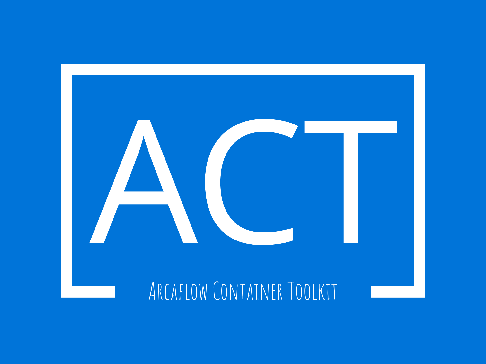

<p align="center"></p>

<!-- markdownlint-configure-file {
  "MD013": {
    "code_blocks": false,
    "tables": false
  },
  "MD033": false,
  "MD041": false
} -->

<div align="center">

Arcaflow Container Toolkit is a tool used to automatically test, build, and publish Arcaflow plugins to Quay.

</div>

## Table of Contents

• [Requirements](#requirements)  
• [Configuration](#configuration)  
• [Build Arcaflow Container Toolkit as an Executable Locally](#build-arcaflow-container-toolkit-as-an-executable-locally)  
• [Arcaflow Container Toolkit as a Package](#arcaflow-container-toolkit-as-a-package)  
• [Arcaflow Container Toolkit and Reusable Workflows](#arcaflow-container-toolkit-and-reusable-workflows)  
• [Arcaflow Container Toolkit as an Action](#arcaflow-container-toolkit-as-an-action)  

## Requirements

* golang v1.18
* docker
* python 3 and pip
* flake8

Each plugin directory must meet the [Arcaflow Plugins Requirements](https://github.com/arcalot/arcaflow-plugins#requirements-for-plugins).

## Configuration

Configuring Arcaflow Container Toolkit can be configured using the `act.yaml` configuration file, or by using environment variables. More details are below.

example `.act.yaml`  
```yaml
revision: 20220824
image_name: "<IMAGE_NAME>"
image_tag: "<IMAGE_TAG>"
project_filepath: "<path/to/plugin/project/>"
registries:
  - url: quay.io
    username_envvar: "<QUAY_USERNAME>"
    password_envvar: "<QUAY_PASSWORD>"
    namespace_envvar: "<QUAY_NAMESPACE>"
```

### Configurable Variables

#### Required:
  `IMAGE_NAME` Name of the image that Arcaflow Container Toolkit will build - string  
  `IMAGE_TAG`  Tag of the image that Arcaflow Container Toolkit will build - string
#### Required for Publishing to Quay:
  `QUAY_USERNAME` Quay Username to be used for credentials - Default: ""  
  `QUAY_PASSWORD` Quay Password to be used for credentials - Default: ""  
  `QUAY_NAMESPACE` Quay Namespace to push image - Default: "" 
#### Optional:    
  `QUAY_CUSTOM_NAMESPACE` Quay Namespace to push image that is not QUAY_NAMESPACE - Default: ""  
  `QUAY_IMG_EXP` Image label to automatically expire in Quay - Default: "never"  
  `BUILD_TIMEOUT` Length of time before a build will fail in seconds - Default: 600  

#### Additional Information

* `QUAY_IMG_EXP` more documentation and time formats can be found [here](https://docs.projectquay.io/use_quay.html#:~:text=Setting%20tag%20expiration%20from%20a%20Dockerfile)
* `QUAY_CUSTOM_NAMESPACE` if set, will use in place of `QUAY_NAMESPACE`. More info [Arcaflow Container Toolkit and Reusable Workflows](#arcaflow-container-toolkit-and-reusable-workflows)

## Build Arcaflow Container Toolkit as an Executable Locally

Arcaflow Container Toolkit can be ran locally by building an executable from the project's root directory.
Configure the `act.yaml` and or set environment variables for build options.  

#### Build the executable

```shell
go build act.go
```

#### Arcaflow Container Toolkit test and build

```shell
./act build --build
```

#### Arcaflow Container Toolkit test, build, and push

```shell
./act build --build --push
```

## Arcaflow Container Toolkit as a Package

Pull the latest image

```shell
docker pull ghcr.io/arcalot/arcaflow-container-toolkit:latest
```

Run the Arcaflow Container Toolkit image with enviornment variables

```shell
docker run \
    --rm \
    -e=IMAGE_TAG="0.0.1"\
    -e=BUILD_TIMEOUT=600\
    -e=QUAY_USERNAME=$QUAY_USERNAME\
    -e=QUAY_PASSWORD=$QUAY_PASSWORD\
    -e=QUAY_NAMESPACE=$QUAY_NAMESPACE\
    --volume /var/run/docker.sock:/var/run/docker.sock:z \
    --volume $PWD/../arcaflow-plugin-template-python:/github/workspace \
    ghcr.io/arcalot/arcaflow-container-toolkit:latest build --build --push
```

## Arcaflow Container Toolkit and Reusable Workflows

Arcaflow Container Toolkit can be utilized using the official reusable workflow `arcalot/arcaflow-containter-toolkit/.github/workflows/reusable_workflow.yaml`. 

```yaml
name: Arcaflow Container Toolkit
on:
  push:
    branches:
      - "**"
  release:
    types:
      - published

jobs:
  arcaflow-container-toolkit:
    uses: arcalot/arcaflow-container-toolkit/.github/workflows/reusable_workflow.yaml@main
    with:
      image_name: ${{ github.event.repository.name }}
      image_tag: 'latest'     
    secrets: 
      QUAY_NAMESPACE: ${{ secrets.QUAY_NAMESPACE }}
      QUAY_USERNAME: ${{ secrets.QUAY_USERNAME }}
      QUAY_PASSWORD: ${{ secrets.QUAY_PASSWORD }}

```

#### Additional Information

* This workflow will automatically configure `IMAGE_TAG` to version if a release is detected.
* This workflow will automatically configure `IMAGE_TAG` to the format `branch_commit-hash[0:7]` if a development branch is detected.
* This workflow will automatically configure `QUAY_IMG_EXP` to 90 days if a development branch is detected.

## Arcaflow Container Toolkit as an Action

Arcaflow Container Toolkit can be utilized as an action in a workflow.  

```yaml
- name: arcaflow-container-toolkit-action
        uses: arcalot/arcaflow-container-toolkit-action@v0.1.0
        with:
          image_name: ${{ github.event.repository.name }}
          image_tag: 'latest'
          quay_username: ${{ secrets.QUAY_USERNAME }}
          quay_password: ${{ secrets.QUAY_PASSWORD }}
          quay_namespace: ${{ secrets.QUAY_NAMESPACE }}
          quay_custom_namespace: 'example' # This is optional, for reference

```
